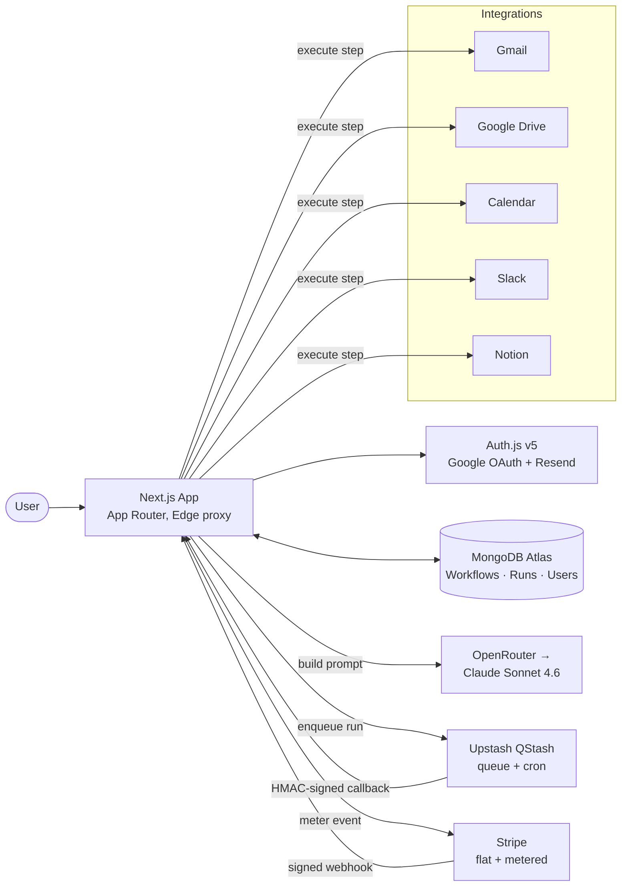

# AutoMate

> **Automate anything you can describe.** Type a workflow in plain English — AutoMate's AI builds the structured workflow and runs it across your Gmail, Drive, Slack, Notion, and Calendar accounts. No clicking through menus, no learning curves.


[**Live demo →**](https://useautomate.app) · [**Demo video →**](#) · [Project context](#) · Built by [Rakibul Islam](https://www.linkedin.com/)

---

## Why AutoMate

Zapier is powerful but it expects you to learn its mental model: connect → choose trigger → pick action → map fields → test. That's an hour of clicking for one automation.

AutoMate flips it. You **describe** what you want. Claude reads the prompt, picks the right trigger, sequences the steps, fills in real database/channel ids from your connected accounts, and emits a structured workflow you can run with one click.

> *"When I get a Gmail with 'invoice' in the subject, save the attachment to my Drive 'Invoices' folder and notify #finance in Slack with the subject and a link."*

That sentence ↑ becomes a real, runnable, observable workflow in about 4 seconds.

---

## Architecture



**Two queues, one executor:**

1. **Manual & scheduled runs** — `enqueueWorkflowRun()` publishes to QStash. The signed callback at `/api/qstash/workflow-execute` verifies the request, loads the run, and walks the workflow steps.
2. **Email triggers** — A QStash recurring schedule pings `/api/triggers/poll` every minute. It walks active Gmail-triggered workflows, queries Gmail for new matches, and fans out one queued run per matching email.

Same executor for both paths. Same fail-fast policy. Same per-step cost tracking.

---

## Tech stack

| Layer | Choice | Why |
| --- | --- | --- |
| Framework | Next.js 16 (App Router + Turbopack) | RSC for cheap dashboards, edge proxy for auth |
| Language | TypeScript (strict) | Catch DSL mistakes at compile time |
| Auth | Auth.js v5 (`next-auth@beta`) | Google OAuth + Resend magic-link, JWT sessions |
| DB | MongoDB Atlas + Mongoose 9 | Mixed-type workflow definitions, simple ops |
| AI | OpenRouter → Claude Sonnet 4.6 | Best reasoning for structured-output workflows |
| Queue | Upstash QStash | Durable cron + HTTP delivery, free-tier friendly |
| Integration OAuth | Arctic 3 (Google + Notion) + custom Slack | Slack v2 needs bot scopes + PKCE — Arctic doesn't cover |
| Billing | Stripe Subscriptions + V2 Meter Events | Flat plans + per-run overage |
| Email | Resend | Magic-link delivery + payment-failed transactional |
| Validation | Zod 4 + custom DSL validator | Two-pass: shape then semantics |
| UI | Tailwind v4 + shadcn/ui + Radix | Headless primitives, easy theming |
| Styling | Instrument Serif (display) + Geist Sans (body) + Geist Mono (code) | Editorial feel, no licensing fuss |
| Observability | Mongoose `ErrorLog` + `EventLog` collections | Self-hosted — no third-party data leakage |
| Deploy | Vercel (Pro) | Edge proxy + serverless executor + scheduled QStash |

---

## Security

- **OAuth tokens encrypted at rest** with AES-256-GCM (`src/lib/crypto.ts`). The encryption key never leaves the server.
- **Inbound queue callbacks** (QStash + Stripe) are HMAC-signature-verified before the handler runs.
- **Workflow DSL** is re-validated against a Zod schema on every execution — defense against MongoDB Mixed-type drift.
- **Integration ownership** verified per step: the executor refuses to use an `integrationId` that doesn't belong to the run's user.
- **No env-var or operator-instruction strings ever leak to user-facing UI.** All admin context lives in the server log.
- **Auth.js JWTs** signed with `AUTH_SECRET`; sessions are stateless.
- **Self-hosted error tracking** — no Sentry, no LogRocket, no third-party data egress.

---

## Local setup

### Prerequisites

- Node 22+
- pnpm 10+
- MongoDB (Atlas free tier works)
- Accounts at: [Upstash](https://console.upstash.com/qstash), [Stripe](https://dashboard.stripe.com) (test mode), [OpenRouter](https://openrouter.ai), [Resend](https://resend.com)
- Google Cloud OAuth client (for sign-in **and** for Gmail/Drive/Calendar scopes — can be the same client)
- Slack app (with bot scopes) and Notion integration if you want those integrations

### Steps

```bash
# 1. Install deps
pnpm install

# 2. Copy env template
cp .env.example .env.local
# Fill in MONGODB_URI, AUTH_SECRET, QSTASH_*, OPENROUTER_API_KEY,
# ENCRYPTION_KEY (openssl rand -hex 32), STRIPE_*, etc.

# 3. Start a public tunnel (QStash + OAuth callbacks need a public URL)
ngrok http 3000
# Set NEXT_PUBLIC_APP_URL to the https URL ngrok prints

# 4. Run dev
pnpm dev

# 5. Bootstrap the Gmail-trigger poll schedule (one-time)
pnpm tsx scripts/setup-poll-schedule.ts
```

Then sign in at <http://localhost:3000>.

### Make yourself an admin

```bash
mongosh "<your-mongodb-uri>" --quiet --eval \
  'db.users.updateOne({email: "you@example.com"}, {$set: {isAdmin: true}})'
```

Sign out and back in to refresh the JWT.

---

## Deploy to Vercel

1. Push to GitHub.
2. Import the repo in Vercel → set the env vars (regenerate `AUTH_SECRET`, `ENCRYPTION_KEY`, `WORKFLOW_SIGNING_SECRET` for production — don't reuse dev values).
3. Set `NEXT_PUBLIC_APP_URL` to your production domain.
4. Add the production callback URL to your Google / Slack / Notion OAuth apps.
5. Set the Stripe webhook endpoint to `https://your-domain.com/api/stripe/webhook` and paste the signing secret into `STRIPE_WEBHOOK_SECRET`.
6. Run `pnpm tsx scripts/setup-poll-schedule.ts` once locally with `NEXT_PUBLIC_APP_URL` pointing at production to register the prod poll schedule.

---

## Scripts

| Command       | What it does                |
| ------------- | --------------------------- |
| `pnpm dev`    | Next.js dev (Turbopack)     |
| `pnpm build`  | Production build            |
| `pnpm start`  | Run the production build    |
| `pnpm lint`   | ESLint                      |
| `pnpm tsx scripts/setup-poll-schedule.ts` | Register the every-minute Gmail-trigger poll with QStash |
| `pnpm tsx scripts/test-dsl.ts`            | Sanity tests for the DSL + validator + interpolator      |

---

## Project shape

```
src/
├── app/
│   ├── (marketing)/      # Public landing + pricing + legal
│   ├── (auth)/           # Sign-in / sign-up
│   ├── (dashboard)/      # Workflows, runs, integrations, billing, settings
│   ├── (admin)/          # Internal admin surfaces
│   └── api/              # Route handlers (REST + QStash callbacks + Stripe webhook)
├── components/
│   ├── marketing/        # Landing-page sections
│   ├── workflows/        # Builder, editor, flowchart, step dialogs
│   ├── runs/             # Run detail, step cards, live updates
│   ├── billing/          # Plan + usage + upgrade modal
│   └── ui/               # shadcn primitives
├── lib/
│   ├── workflows/        # DSL, validator, interpolator, executor + per-type executors
│   ├── integrations/     # Gmail, Drive, Calendar, Slack, Notion adapters
│   ├── oauth/            # Per-provider OAuth flows, encrypted token storage
│   ├── ai/               # OpenRouter client + prompt templates
│   ├── queue/            # QStash client + signature verifier
│   ├── stripe/           # Stripe client + plan config
│   ├── usage/            # Quota gate + meter events + period reset
│   └── db/               # Mongoose connect + models
└── server/actions/       # Server actions for forms (workflows, integrations)
```

---

## What I'd build next if this were Series-A

- **Per-user poll fan-out** so 1,000 users don't share one Gmail-poll function call.
- **Inngest or Temporal** for durable step execution — survive Vercel deploys mid-run.
- **Notion database-schema cache** with TTL to halve API calls under load.
- **Distributed tracing** across enqueue → callback → execute.
- **Per-step retry policies** in the DSL.

See `AGENTS.md` for project conventions and `MEMORY.md` for collaboration context (used by Claude Code).

---

## License

MIT — see `LICENSE`.

---

Built by **Rakibul Islam** · [LinkedIn](https://www.linkedin.com/) · [GitHub](https://github.com/) · Open to AI engineering / freelance via Toptal · Arc.dev · DMs welcome.
